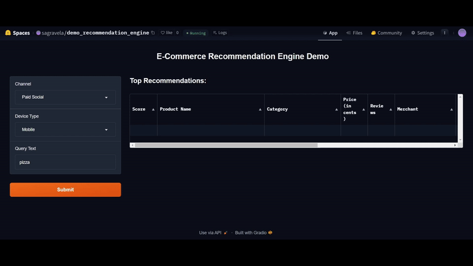

# E-commerce Recommendation Engine

This project demonstrates the end-to-end implementation of a deep learning-based recommendation system using TensorFlow Recommenders (TFRS). The system is designed to deliver personalized product recommendations by analyzing user interactions such as searches, clicks, add-to-cart actions, and purchases. It leverages a dataset of user interaction data sourced from an e-commerce platform and applies advanced deep learning techniques to model user preferences. This approach enhances the shopping experience by providing highly relevant product suggestions tailored to individual users, making the recommendation system both accurate and scalable.  
  

## Features
- **Unified Model Architecture**: Integrates the entire recommendation system into a single cohesive model, including all necessary preprocessing layers.
- **Advanced Embeddings**: Utilizes embeddings for both users and items to capture and leverage latent features, enhancing recommendation precision.
- **Deep Neural Network**: Employs a multi-layered deep neural network on top of embeddings to model complex user-item interactions and improve recommendation quality.
- **Multi-Task Learning Capabilities**: Supports various tasks, including retrieval and ranking, within the same framework to streamline performance.
- **Efficient Retrieval**: Optimizes the retrieval process to quickly identify and suggest the most relevant products for user queries.
- **Enhanced Ranking**: Refines the ordering of recommended products based on user preferences and contextual relevance.
- **Flexible and Extensible**: Designed to be easily adaptable with additional features and interactions to suit diverse use cases.

## Get Started
Try out the demo on [Hugging Face Space](https://huggingface.co/spaces/sagravela/demo_recommendation_engine).